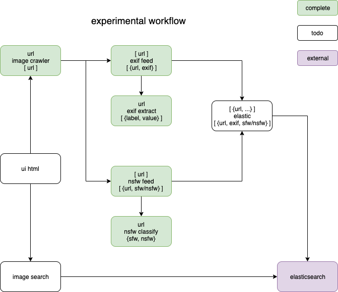

# gezellig
An experiment and purely FaaS pipeline for image analysis that leverages [OpenFaaS](https://openfaas.com)

Inspired by [cozyish](https://github.com/scottleedavis/cozyish)



### Setup
```bash
# have downloaded openfaas-exif, openfaas-exiffeed, openfaas-imagecrawl, openfaas-opennsfw, inception
```

### Run
```bash
./run.sh
```

### Dependencies
* [OpenFaaS](http://openfaas.com) & [faas-cli](https://github.com/openfaas/faas-cli)
* [Kubernetes](https://kubernetes.io)
