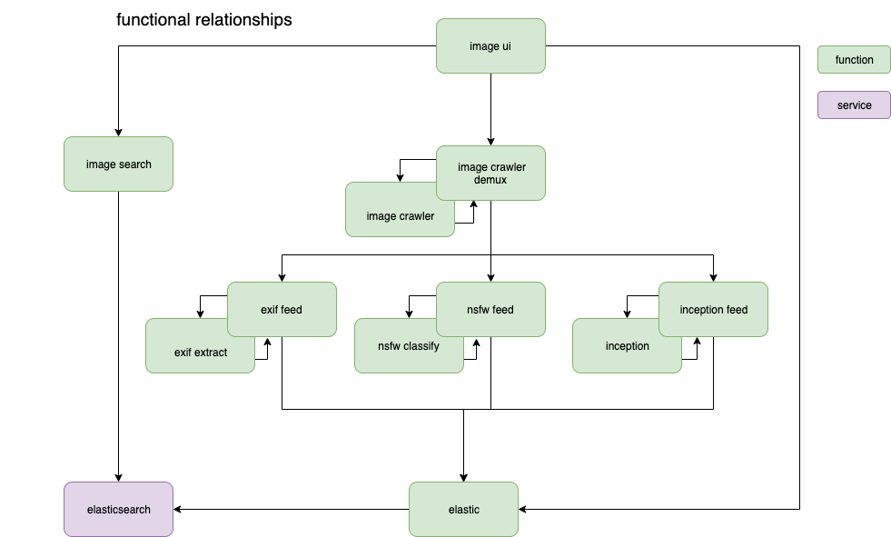

# gezellig
An experiment and purely FaaS pipeline for image analysis that leverages [OpenFaaS](https://openfaas.com)

Inspired by [cozyish](https://github.com/scottleedavis/cozyish)



### Function dependencies
* [openfaas-imagecrawl](https://github.com/servernull/openfaas-imagecrawler)
* [openfaas-exif](https://github.com/servernull/openfaas-exif)
* [openfaas-exiffeed](https://github.com/servernull/openfaas-exiffeed)
* [openfaas-opennsfw](https://github.com/servernull/openfaas-opennsfw)
* [openfaas-opennsfwfeed](https://github.com/servernull/openfaas-opennsfwfeed)
```

### Run
```bash
./run.sh
```

### Dependencies
* [OpenFaaS](http://openfaas.com)
* [faas-cli](https://github.com/openfaas/faas-cli)
* [Kubernetes](https://kubernetes.io)
