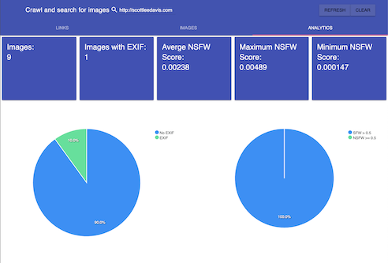

# gezellig
An experiment and purely FaaS pipeline for image analysis that leverages [OpenFaaS](https://openfaas.com)

Inspired by [cozyish](https://github.com/scottleedavis/cozyish)


### Screenshots





### Installation
```
# create a cluster.  (minikube in this example)
minikube start --vm-driver=hyperkit \
  --memory 4048mb \
  --kubernetes-version='v1.15.0'

# instal k3sup
curl -SLfs https://get.k3sup.dev | sudo sh

# install openfaas
k3sup app install openfaas --load-balancer

#install functions
# todo
```
### Function dependencies
* [openfaas-imagecrawl](https://github.com/servernull/openfaas-imagecrawler)
* [openfaas-exif](https://github.com/servernull/openfaas-exif)
* [openfaas-exiffeed](https://github.com/servernull/openfaas-exiffeed)
* [openfaas-opennsfw](https://github.com/servernull/openfaas-opennsfw)
* [openfaas-opennsfwfeed](https://github.com/servernull/openfaas-opennsfwfeed)
* [inception-function](https://github.com/faas-and-furious/inception-function)
* [openfaas-inceptionfeed](https://github.com/servernull/openfaas-inceptionfeed)
* [openfaas-elastic](https://github.com/servernull/openfaas-elastic)
* [openfaas-imagesearch](https://github.com/servernull/openfaas-imagesearch)
* [openfaas-imagesearchdemux](https://github.com/servernull/openfaas-imagesearchdemux)
* [openfaas-imageui](https://github.com/servernull/openfaas-imageui)

### Dependencies
* [OpenFaaS](http://openfaas.com)
* [faas-cli](https://github.com/openfaas/faas-cli)
* [Elasticsearch](https://www.elastic.co/)

